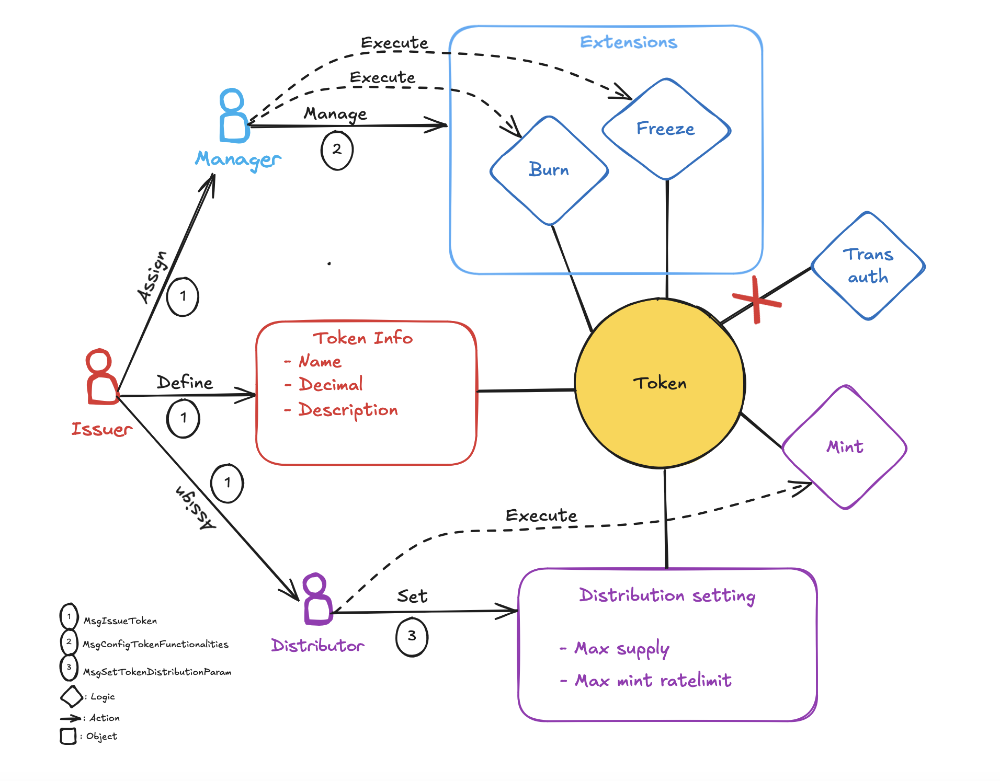
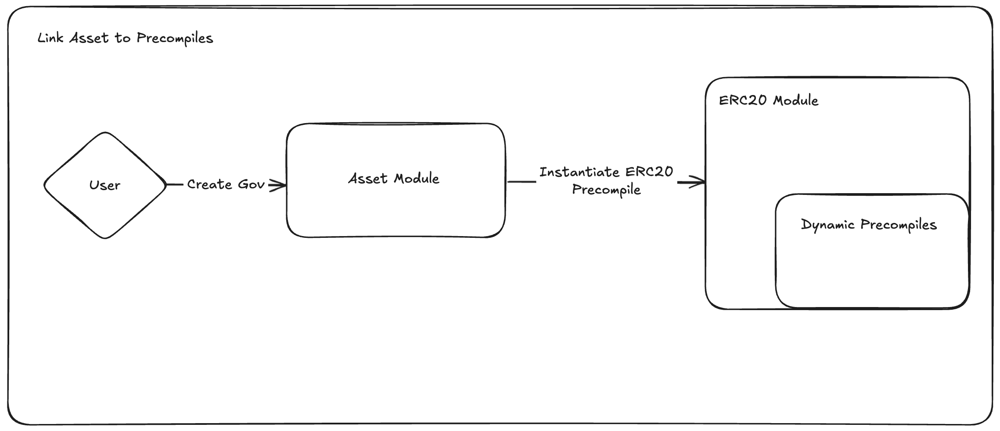
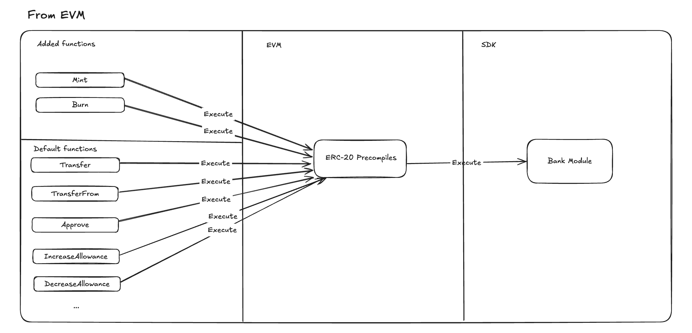

<!--
order: 0
title: Asset Overview
parent:
  title: "asset"
-->

# `asset`

## The Realio Asset Token Model

The Realio Asset module is centered around a token model where certain whitelisted accounts can issue their own token. A token issued by this module will be managed by two different roles, manager and distributor. These roles can be assigned to arbitrary accounts (could be either user accounts or module/contract account) by the token issuer.

Each token can choose to enable functionalities supported by the module. Currently, there are four functionalities supported: "mint", "freeze", "clawback", "transfer_auth", each handle a completely different logic. We wanna decouple the logic of these functionalities from the `Asset module`, meaning that they will be defined in separate packages/modules, thus, developers can customize new functionalities without modifying the `Asset Module`. Doing this allows our token model to be extensible while keeping the core logic of `Asset Module` untouched and simple, avoiding complicated migration when we integrating new features.

The token manager's task is to choose what functionalities it wants to disable/enable for its token; and only the token manager can trigger those functionalities, except for the `mint` functionality which is handled by the `distributor`.

## Asset Module and ERC-20 Precompiles

ERC-20 precompiles are offered by evmOS for better interacting with Cosmos SDK. Instead of changing the state of evm, with ERC-20 precompiles, modules now can represent ERC-20 token in the form of normal bank token and therefore can be managed by SDK modules (single token representation). Utilizing this feature enables the evm contracts to interact with the asset tokens via erc20 call, opening lots of defi usecases for the asset module.

### Link Asset to Precompiles

To link an asset to ERC20 Precompile, user have to create a gov proposal so that Asset Module can interact with ERC-20 module to registerERC20 and change their params (`Dynamic Precompiles` field). After linking, all call to the token contract will now redirect to precompile instead of the evm.

### Mapping functions

ERC20 precompiles come with a limited number of functions which are:

- Transfer
- TransferFrom
- Approve
- IncreaseAllowance
- DecreaseAllowance

These functions can be called from both AssetModule and EVM side (by metamask for example).

Other functions like:

- Mint
- Burn

can only be called from Asset Module side.

## Contents

1. **[Concept](01_concepts.md)**
2. **[State](02_state.md)**
   - [Minter](02_state.md#minter)
   - [Params](02_state.md#params)
3. **[Parameters](03_params.md)**
4. **[Messages](04_msgs.md)**
5. **[Client](05_client.md)**
   - [CLI](05_client.md#cli)
   - [gRPC](05_client.md#grpc)
   - [REST](05_client.md#rest)
