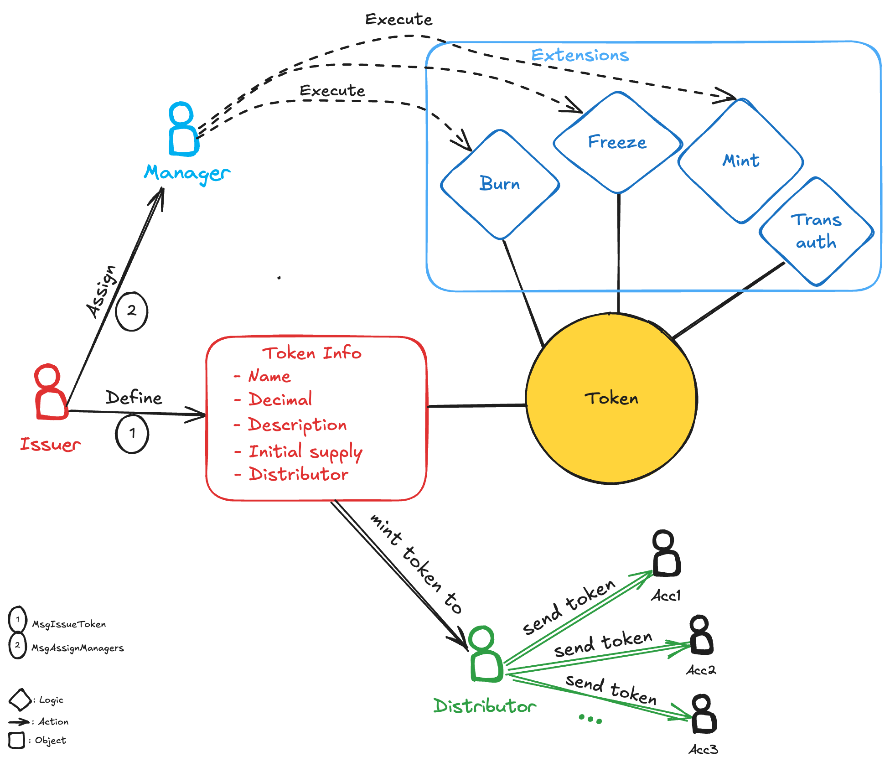

<!--
order: 0
title: Asset Overview
parent:
  title: "asset"
-->

# `asset`

## The Realio Asset Token Model

The Realio Asset module is centered around a token model where certain whitelisted accounts can issue their own token. A token issued by this module will be defined by the `issuer` and managed by the `manager` role. `manager` role can be assigned to arbitrary accounts (could be either user accounts or module/contract account) by the token issuer.

Token extensions are additional features that can be flug-in for each token. There're are four types of extensions `Mint`, `Burn`, `Transfer Auth` and `Freeze`. The `Issuer` can choose what extensions to be included for his token at creation time, and only the `manager` can trigger the extension's logic.

`

## Asset module precompile

To enhance user experience as well as interoperability with EVM contracts, we decide to build a precompile for the asset module. All the messages of asset modules can now also be triggered with an evm call. Thus, evm contracts can interact with the module and users can call the modules via metamask or any ethereum friendly UI.

## ERC-20 Precompiles

ERC-20 precompiles are offered by evmOS for better integration with Cosmos SDK. With ERC-20 precompiles, we now can have bank tokens with the interface of erc-20 contracts and therefore can talk to other EVM contracts. Utilizing this feature enables the evm contracts to interact with the asset tokens via erc20 call, opening lots of defi usecases for the asset module.

### Link Asset to Precompiles

Each token of the asset module is automatically linked to ERC20 Precompile, when issuer execute the MsgIssueToken, a new token instance will be created in the asset module and a new evm address is derived based on the token's info, which will be assigned an erc20-precompiles. After that, all calls to the evm address will now redirect to the erc20-precompiles.

### Token extensions call via precompiles

Each ERC20 precompiles come with a limited number of call which are:

- Transfer
- TransferFrom
- Approve
- IncreaseAllowance
- DecreaseAllowance

We introduce these optional calls to precompile to execute the token's extensions:

- Mint
- Burn
- Freeze
- TransferAuth

It's important to note that each token has its own set of enabled extensions, the precompile linked to that token must also reflect that. In other words, for each precompile these calls will be enabled/disabled however the linked token's extensions be.

## Contents

1. **[Concept](01_concepts.md)**
2. **[State](02_state.md)**
   - [Token](02_state.md#token)
   - [TokenManagement](02_state.md#tokenmanagement)
   - [TokenDistribution](02_state.md#tokendistribution)
   - [WhitelistAddresses](02_state.md#whitelistaddresses)
   - [DynamicPrecompiles](02_state.md#dynamicprecompiles)
3. **[Parameters](03_params.md)**
4. **[Messages](04_msgs.md)**
5. **[Query](05_query.md)**
6. **[Logic](06_logic.md)**
   - [Extension](06_logic.md#extension)
   - [EVM interaction](06_logic.md#evm-interaction)
